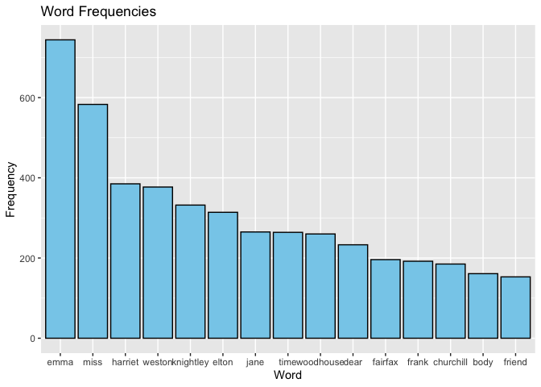

Strings and functional programming in R
================
Tingyu (Johnson) Chen
2023-12-03

# Exercise 1

Take a Jane Austen book contained in the janeaustenr package, make a
plot of the most common words in the book, removing stopwords from a
pre-defined source, tidytext::stop_words.

If you use any resources for helping you remove stopwords, or some other
resource besides the janeaustenr R package for accessing your book,
please indicate the source. We aren’t requiring any formal citation
styles, just make sure you name the source and link to it.

``` r
library(janeaustenr)
book_emma <- unlist(str_split(janeaustenr::emma,pattern = " ")) %>% 
  tolower() %>% str_replace_all("[^a-zA-Z]", "")
book_emma <- book_emma[nzchar(book_emma)]
```

Using `nzchar` from
[nzchar](https://www.geeksforgeeks.org/check-if-elements-of-a-vector-are-non-empty-strings-in-r-programming-nzchar-function/)

``` r
emma_nostop <- book_emma[!(book_emma %in% tidytext::stop_words$word)]
ggplot(data.frame(head(sort(table(emma_nostop),decreasing = T),n = 15))) + 
  geom_bar(aes(x = emma_nostop, y = Freq),stat = "identity", fill = "skyblue", color = "black")+
  labs(title = "Word Frequencies", x = "Word", y = "Frequency")
```

<!-- -->

# Exercise 2

Make a function that converts words to your own version of Pig Latin.

Johnson Chen version: Piglet Latin

Move first half of the word (first half round up) to the end of word,
and add “comrade” to the end of word if the word is not in
`tidytext::stop_words`

The specific input and output that you decide upon is up to you. Don’t
forget to implement good function-making hygiene: we’ll be looking for
(unrendered) roxygen2-style documentation (being sure to describe your
Pig Latin conversion), examples of applying the function, 3
non-redundant tests, appropriate use of arguments, and appropriate
amount of checking for proper input.

## Function and Documentation

``` r
#' Piglet Latin Game
#' 
#' @description Given a word or vector of words and move first half of the word 
#' (first half round up) to the end of word, and add "comrade" to the end of word 
#' if the word is not in `tidytext::stop_words`
#' 
#' @details This function utilizes the `stop_words` in the `tidytext` package.
#' 
#' @param words a string or vector of strings, no special character is present.
#' 
#' @return A string or vector of strings the same length with `word`, 
#' through transformation described above
piglet_latin <- function(words) { 
  
  
  if(!is.character(words)) { 
    stop("input must be a character or vector of characters")
  }
  if (!requireNamespace("tidytext", quietly = TRUE)) {
    install.packages("tidytext", dependencies = TRUE)
    library(tidytext, character.only = TRUE)
  }
  letter <- ceiling(nchar(words)/2)
  return(str_c(str_sub(words, letter +1),str_sub(words, 1, letter),
               paste(ifelse(words %in% tidytext::stop_words$word, "", "comrade"))))

}
```

## Examples

This example inputs the word “student”, which is not a stop word

``` r
piglet_latin("student")
```

    ## [1] "entstudcomrade"

This example inputs the word “according”, which is a stop word. Notice
that the output does not have the suffix “-comrade”.

``` r
piglet_latin("according")
```

    ## [1] "dingaccor"

This example inputs a vector consisting of a quote, notice the output is
also a vector of string, and each word is individually verified by stop
words.

``` r
piglet_latin(c("War","is","peace","Freedom", "is", "slavery","Ignorance", "is", "strength"))
```

    ## [1] "rWacomrade"       "si"               "cepeacomrade"     "domFreecomrade"  
    ## [5] "si"               "eryslavcomrade"   "anceIgnorcomrade" "si"              
    ## [9] "ngthstrecomrade"

## Tests

The first test checks whether the function gives the same result as
directly applying the rule of piglet latin described above.

The second test checks the error handling for malformed `words` input
arguments. We check that the invalid input `NULL`, numerical and object
input would all cause an error.

``` r
test_that("Output matches to the Piglet Latin Rules", { 
  words <- c("about","Charlie","and", "dentist")
  
  expect_equal(piglet_latin(words), c("utabo","lieCharcomrade","dan","istdentcomrade")
              )
})
```

    ## Test passed 🌈

``` r
test_that("Checking error handling for input", { 
      expect_error(
        piglet_latin(545)
      )
      expect_error(
        piglet_latin(data.frame(x =  c("About","Charlie","and", "dentist")))
      )
      expect_error( 
        piglet_latin(NULL)
      )
  })
```

    ## Test passed 🎊
